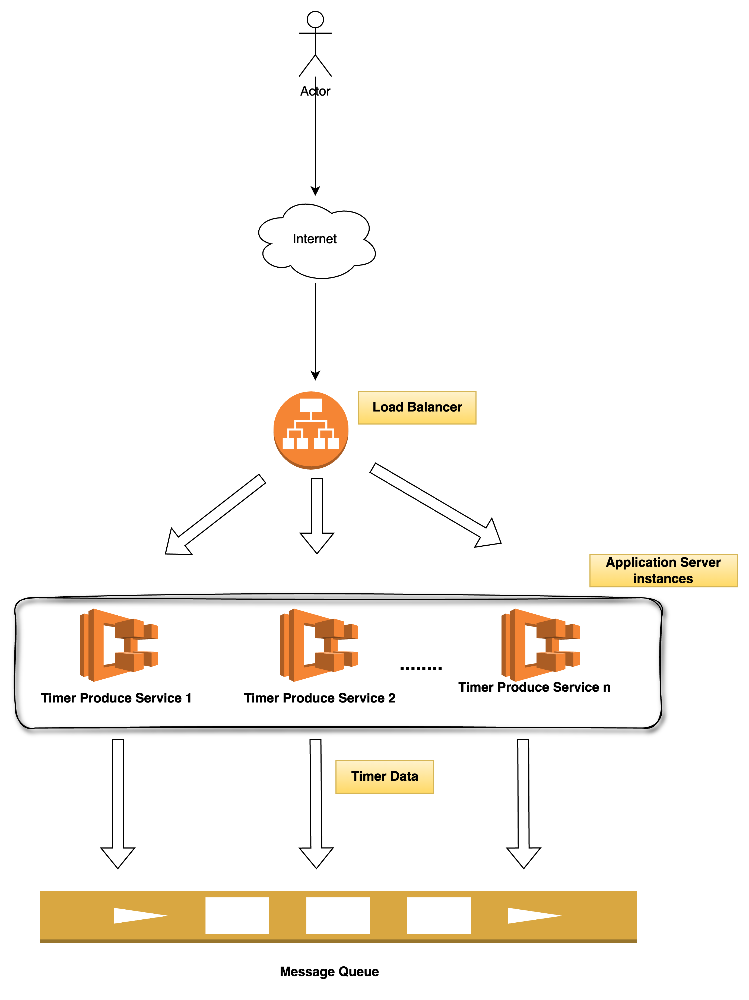

## Description

Timer Producer Service to create and fetch timers

## Prerequisite
- Nodejs version: `v18.13.0`
- NestJs: `v10`
- Typescript
- Docker


###### You need specific version of nodejs only when you run the app without Docker. In that case please follow the steps mentioned below
- Start kafka in container mode by running the following command in your terminal
    - `docker run -p 9092:9092 apache/kafka:3.7.0` 
    - Once Kafka is up and running then follow the steps mentioned below
    - Note: [To run kafka without container, please follow the steps mentioned here](https://kafka.apache.org/quickstart)
-  Start Mongodb in container mode by running the following command in your terminal
    - `docker run -p 27017:27017 mongo:6.0.13-jammy`
    - Once Mongodb is up and running then follow the steps mentioned below
    - Note: [To run mongodb without container, please follow the steps mentioned here](https://www.mongodb.com/docs/manual/installation/)
    - [Or you may create a free cluster here](https://www.mongodb.com/products/tools/compass)
- Once above-mentioned steps the are done, please run the following command to install the dependencies & start the app

## Tech Stack
- Node.js
- Typescript
- Nestjs
- MongoDB
- TypeOrm
- Kafka
- Docker
- Redis

## Architecture Diagram
In order to keep the systems decoupled and scalable, I have to brake down the requirement into three separate components as mentioned below:
`Note`:
- DB can be a bottleneck under a high write load. So,  to tackle this scenario, I have decided to process the timer data(`Create API`) asyncronously via message queue
    - This approach also promotes `separation of concerns` and `Scalability`, since we can scale each system `independently`.
- ### Producer Service
    - This service will expose the `Create` & `Get` timer apis to the end user
    - Get API might return `timer not found` error if its called right after the create timer API in some cases since the timer is being created asyncronously.
        - In order to handle this scenario, we may use redis to hold the timer data 
        - This approach can also be useful if we have large number of `READ` requests to the system

- ### Consumer Service
    - This service will only be responsible for consumering the message queue's message and persisting the data to database

- ### Runner/Executer Service
    - This service will be responsible for the following tasks
        - Fetch the timer data from DB (Only scheduled) at a regular interval (cron job)
        - Schedule the timers
        - Fire the timers




## Installation

```bash
$ npm install
```

## Running the app

```bash
# development
$ npm run start

# watch mode
$ npm run start:dev

# production mode
$ npm run start:prod
```

## Running the app with Docker

```bash
$ docker-compose up --build
```

## Test

```bash
# unit tests
$ npm run test

# test coverage
$ npm run test:cov
```

## API Doc

```
http://localhost:3000/docs
```

## POSTMAN Collection
Please find the postman collection under `postman_collection` folder and import it into postman


## Potential Improvements & Assumptions
- Since, we're creating the timers asyncronously, So, we don't have any identifier to return to the user. In this case we have to provider an unique identifier back to the user so that user can use it in `GET` API. I have used a `timerId` which is created at the application layer and it's an `UUID`.
    - [The probability of duplicate `UUID` is near to zero or negligible](https://en.wikipedia.org/wiki/Universally_unique_identifier)
- Webhook url validation can done in producer service while creating the timer to validate whether user is providing a valid url or not
    - Sanitisation of the url against possible malacious attacks (sql injections etc)
- Cache integration to reduce the load from DB for read requests (Get Timer API)
- Multiple broker support
    - Or, choose an fully managed service like event bridge (investigation is required)
    - [Fan out method implementation to avoid fetch data from db at a regular interval](https://en.wikipedia.org/wiki/Fan-out_(software))
 